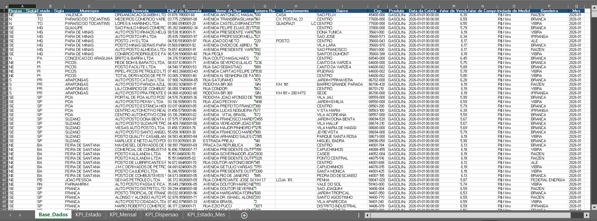
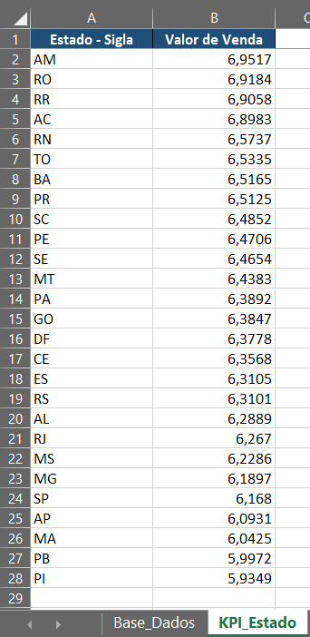
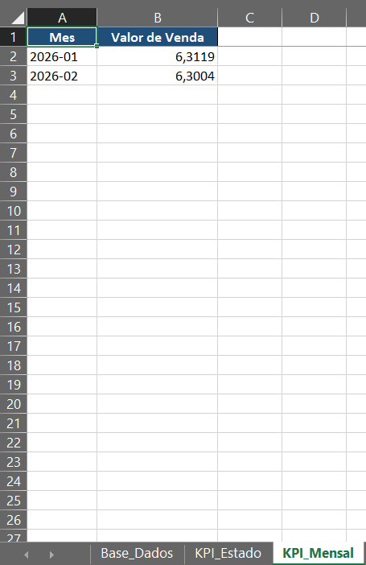
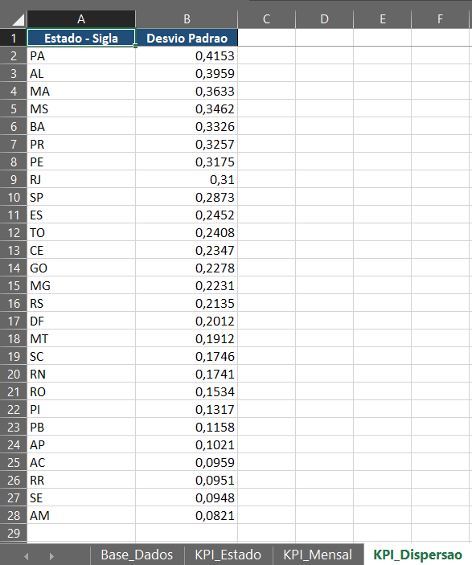
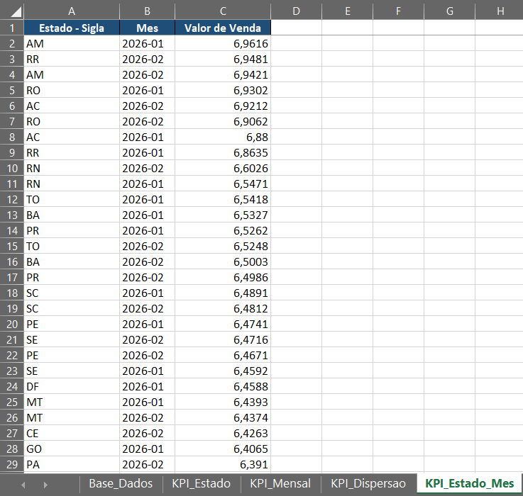

# ANP Fuel Price Report Automation

Automação de análise de preços de combustíveis com Python utilizando dados públicos da ANP, com foco em padronização, redução de trabalho manual e apoio à tomada de decisão recorrente.

Este projeto transforma arquivos brutos da ANP em uma base tratada e um relatório analítico em Excel, automatizando um processo que normalmente seria manual, reduzindo erros operacionais e permitindo análises recorrentes de forma padronizada.

------------------------------------------------------------------------

## Problema

Bases públicas como as da ANP não vêm prontas para análise.

Antes de qualquer insight, é necessário:

-   consolidar múltiplos arquivos
-   padronizar colunas
-   tratar valores inconsistentes
-   corrigir formatos de data e número

Esse processo manual é demorado, sujeito a erro e dificulta análises
recorrentes.

------------------------------------------------------------------------

## Solução

Foi desenvolvido um pipeline automatizado em Python que:

-   lê múltiplos arquivos CSV da ANP
-   consolida os dados em uma única base
-   realiza limpeza e padronização
-   filtra apenas registros de gasolina
-   trata valores inválidos
-   converte datas e preços
-   remove outliers
-   calcula indicadores
-   gera automaticamente um relatório em Excel

O resultado é um fluxo automatizado que permite gerar análises consistentes de forma recorrente, sem necessidade de intervenção manual.

------------------------------------------------------------------------

## 🔍 Hipóteses de Análise

Embora o foco principal do projeto seja a automação do tratamento e da geração do relatório, a estrutura final também permite explorar algumas hipóteses analíticas relevantes sobre os preços de combustíveis.

### 1. Existe variação relevante de preços entre estados e regiões
A consolidação da base permite comparar preços médios por recorte geográfico, facilitando a identificação de diferenças regionais de comportamento.

### 2. Existe dispersão significativa de preços dentro de um mesmo recorte geográfico
A análise de dispersão ajuda a observar se os preços se mantêm relativamente homogêneos ou se apresentam alta variação dentro de estados ou regiões.

### 3. Os preços apresentam comportamento recorrente ao longo do tempo
A visualização por período permite acompanhar oscilações e identificar padrões temporais no comportamento dos preços.

### 4. A diferença entre valores mínimos e máximos pode indicar pontos de atenção para monitoramento
A análise de extremos ajuda a destacar recortes com maior amplitude de preços, o que pode ser útil para acompanhamento periódico e comparação de mercado.

------------------------------------------------------------------------

## Pipeline

data/raw → data/processed → output

------------------------------------------------------------------------

## Dataset

-   Fonte: ANP (Agência Nacional do Petróleo)
-   Produto analisado: Gasolina
-   Período analisado: Jan/2026 a Fev/2026
-   Registros finais após tratamento: 33.942

------------------------------------------------------------------------

## Principais análises

O relatório foi estruturado para responder:

-   qual o preço médio da gasolina por estado
-   como o preço evolui ao longo do tempo
-   quais estados apresentam maior dispersão de preços
-   como o comportamento muda por estado e período

------------------------------------------------------------------------

## 🧠 Decisões que o Relatório Apoia

A automação não apenas gera um relatório estruturado, mas também apoia decisões práticas a partir dos dados analisados.

### 1. Comparação de preços entre estados e regiões
- **Dado utilizado:** preço médio por estado
- **Decisão:** identificar regiões com preços acima ou abaixo da média
- **Impacto:** melhor entendimento do posicionamento regional e suporte à análise de competitividade

---

### 2. Monitoramento da evolução dos preços ao longo do tempo
- **Dado utilizado:** preço médio mensal
- **Decisão:** identificar tendências de alta ou queda
- **Impacto:** antecipação de movimentos de mercado e acompanhamento contínuo

---

### 3. Identificação de inconsistências ou variações internas
- **Dado utilizado:** dispersão de preços por estado
- **Decisão:** detectar regiões com alta variação de preços
- **Impacto:** direcionamento de análises mais detalhadas ou investigação de anomalias

---

### 4. Análise de padrões por estado e período
- **Dado utilizado:** combinação estado x mês
- **Decisão:** identificar padrões recorrentes ou comportamentos específicos
- **Impacto:** suporte a planejamento e acompanhamento operacional

------------------------------------------------------------------------

## Principais descobertas

-   Estados da região Norte apresentaram os maiores preços médios, com
    destaque para AM (\~6,95), RO (\~6,91) e RR (\~6,90)

-   Houve leve queda no preço médio entre janeiro e fevereiro de 2026
    (de 6,3119 para 6,3004)

-   Estados como PA, AL e MA apresentaram maior dispersão de preços,
    indicando maior variação interna

-   São Paulo apresentou preço médio inferior (6,17), sugerindo maior
    estabilidade e competitividade no mercado

------------------------------------------------------------------------

## 📌 Recomendações de Uso Operacional

O relatório automatizado pode ser utilizado de forma recorrente para apoiar o acompanhamento contínuo dos preços de combustíveis.

### 1. Executar o relatório periodicamente
- **Ação:** rodar a automação em intervalos regulares (semanal ou mensal)
- **Por quê:** permite acompanhar a evolução dos preços ao longo do tempo
- **Benefício:** elimina trabalho manual e garante consistência na análise

---

### 2. Utilizar a análise por estado como base de comparação
- **Ação:** comparar preços médios entre estados
- **Por quê:** diferenças regionais são relevantes no comportamento dos preços
- **Benefício:** identificação rápida de regiões com preços acima ou abaixo da média

---

### 3. Monitorar a dispersão de preços
- **Ação:** observar estados com maior variação interna de preços
- **Por quê:** alta dispersão pode indicar inconsistências ou oportunidades
- **Benefício:** direciona análises mais aprofundadas

---

### 4. Integrar o relatório à rotina operacional
- **Ação:** utilizar o relatório como parte do processo de análise periódica
- **Por quê:** a automação reduz esforço manual e padroniza o processo
- **Benefício:** ganho de eficiência e maior confiabilidade dos dados

------------------------------------------------------------------------

## Entregas

-   Base tratada em CSV
-   Relatório Excel com abas:
    -   Base_Dados
    -   KPI_Estado
    -   KPI_Mensal
    -   KPI_Dispersao
    -   KPI_Estado_Mes

------------------------------------------------------------------------

## Estrutura do projeto

anp-fuel-price-report-automation/ ├── assets/ ├── data/ ├── scripts/ ├──
output/ └── README.md

------------------------------------------------------------------------

## Como executar

pip install -r requirements.txt

python scripts/transform_anp_data.py

------------------------------------------------------------------------

## Screenshots

------------------------------------------------------------------------

## Tecnologias

-   Python
-   pandas
-   xlsxwriter
-   openpyxl

------------------------------------------------------------------------

## Aprendizados

-   a maior parte do trabalho em dados está na preparação da base
-   automação só gera valor com lógica consistente
-   dados não tratados levam a análises erradas
-   consistência entre métricas é essencial

------------------------------------------------------------------------

## Autor

Raphael Guardiano

Projeto desenvolvido como parte da transição para a área de análise de
dados, com foco em automação e geração de insights a partir de dados
reais.
