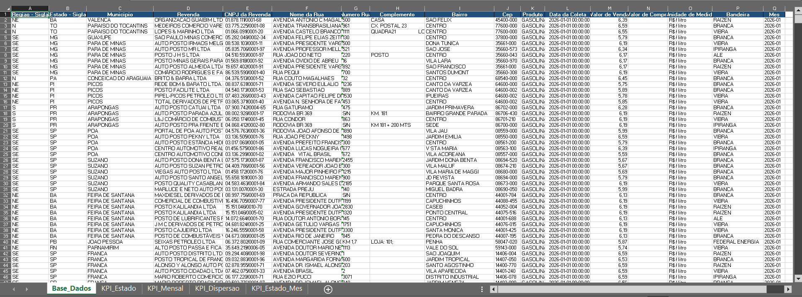
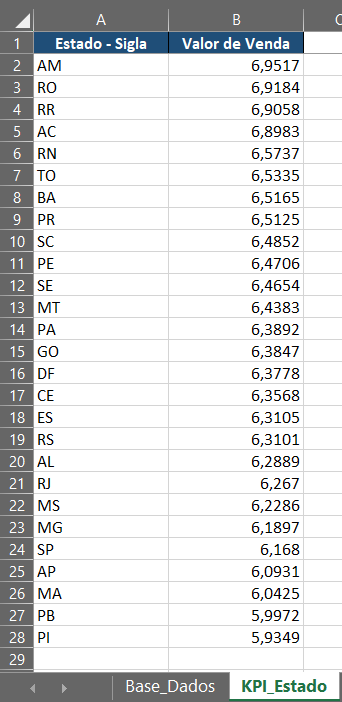
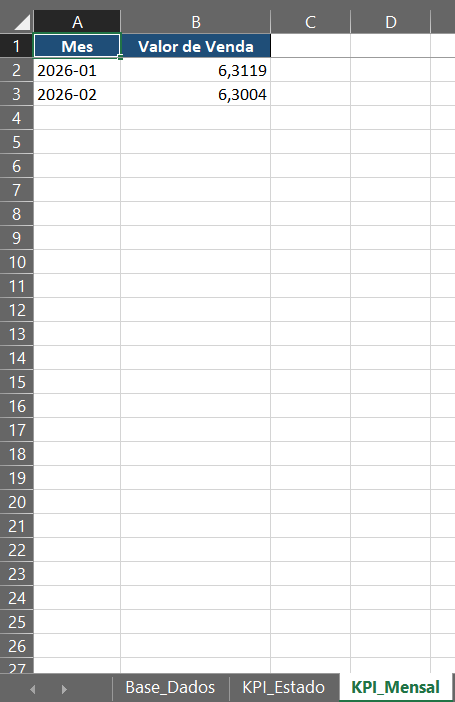
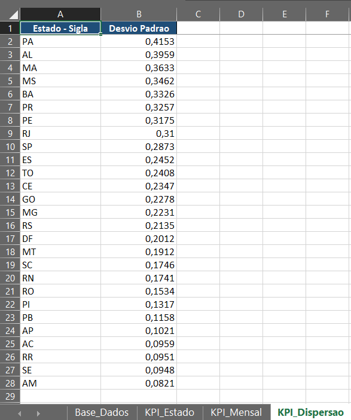
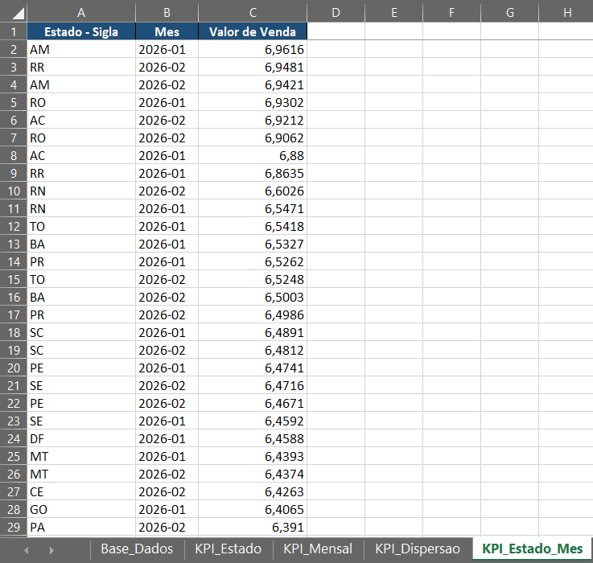

# ⛽ ANP Fuel Price Report Automation — Python

Automação de tratamento, consolidação e análise de preços de combustíveis utilizando Python e dados públicos da ANP, com foco em reduzir trabalho manual, padronizar rotinas analíticas e gerar relatórios recorrentes em Excel.

---

## 📌 Resumo executivo

Este projeto automatiza o tratamento e a análise de dados públicos de preços de combustíveis da ANP.

O pipeline lê múltiplos arquivos CSV, consolida a base, padroniza colunas, trata inconsistências, filtra registros de gasolina, calcula indicadores e gera automaticamente um relatório analítico em Excel.

A automação reduz trabalho manual, melhora a consistência da análise e cria uma estrutura reutilizável para relatórios recorrentes com dados públicos.

---

## 🧭 Como visualizar o projeto

- Os dados brutos devem ser inseridos na pasta `/data/raw`.
- A base tratada é gerada na pasta `/data/processed`.
- O relatório final em Excel é gerado na pasta `/output`.
- O script principal está na pasta `/scripts`.
- As imagens do relatório estão na pasta `/assets`.

---

## 📌 Contexto de negócio

Bases públicas, como as disponibilizadas pela ANP, oferecem grande potencial analítico, mas normalmente exigem preparação antes de serem utilizadas em relatórios, dashboards ou análises recorrentes.

Na prática, esse processo costuma envolver consolidação manual de arquivos, padronização de campos, correção de formatos, tratamento de inconsistências e montagem repetitiva de relatórios.

Quando esse fluxo é feito manualmente, há maior risco de erro, perda de tempo e dificuldade para repetir a análise com novos períodos de dados.

---

## 🎯 Problema de negócio

Empresas e profissionais que acompanham dados recorrentes frequentemente precisam transformar arquivos brutos em relatórios estruturados para apoiar decisões.

No caso dos dados de combustíveis da ANP, antes de qualquer análise é necessário:

- consolidar múltiplos arquivos CSV;
- padronizar nomes de colunas;
- tratar valores inconsistentes;
- corrigir formatos de data e número;
- filtrar o produto de interesse;
- remover registros inválidos ou extremos;
- gerar indicadores comparáveis.

Esse processo manual é demorado, sujeito a falhas e dificulta a criação de uma rotina analítica confiável.

---

## ✅ Solução desenvolvida

Foi desenvolvido um pipeline automatizado em Python para transformar arquivos brutos da ANP em uma base tratada e um relatório analítico em Excel.

O fluxo automatizado realiza:

- leitura de múltiplos arquivos CSV;
- consolidação dos dados em uma única base;
- limpeza e padronização das colunas;
- conversão de datas e preços;
- filtro de registros de gasolina;
- tratamento de valores inválidos;
- remoção de outliers;
- cálculo de indicadores;
- geração automática de relatório em Excel.

O resultado é um processo reproduzível, que permite atualizar a análise com novos arquivos sem reconstruir manualmente todo o relatório.

---

## 🔄 Pipeline do projeto

```text
CSV brutos da ANP
→ leitura automatizada
→ consolidação dos arquivos
→ limpeza e padronização
→ filtro de gasolina
→ tratamento de inconsistências
→ remoção de outliers
→ cálculo de KPIs
→ base tratada em CSV
→ relatório Excel automatizado
```

Fluxo de pastas:

```text
data/raw → data/processed → output
```

---

## 🗂️ Dataset utilizado

- **Fonte:** ANP — Agência Nacional do Petróleo, Gás Natural e Biocombustíveis
- **Produto analisado:** Gasolina
- **Período analisado:** janeiro de 2026 a fevereiro de 2026
- **Registros finais após tratamento:** 33.942
- **Finalidade:** uso de dados públicos para automação de relatório analítico e composição de portfólio.

---

## 🔍 Hipóteses de análise

Embora o foco principal do projeto seja a automação do tratamento e da geração do relatório, a estrutura final permite explorar hipóteses analíticas relevantes sobre preços de combustíveis.

### 1. Existe variação relevante de preços entre estados e regiões

A consolidação da base permite comparar preços médios por recorte geográfico, facilitando a identificação de diferenças regionais.

### 2. Existe dispersão significativa de preços dentro de um mesmo estado

A análise de dispersão ajuda a observar se os preços se mantêm relativamente homogêneos ou se apresentam alta variação dentro de um mesmo recorte geográfico.

### 3. Os preços apresentam variação ao longo do tempo

A visualização por período permite acompanhar oscilações mensais e identificar movimentos de alta ou queda no preço médio.

### 4. A diferença entre valores mínimos e máximos pode indicar pontos de atenção

A análise de extremos ajuda a destacar estados com maior amplitude de preços, o que pode direcionar monitoramentos e análises complementares.

---

## 📈 Indicadores gerados

O relatório foi estruturado para acompanhar:

| Indicador | Descrição |
|---|---|
| Preço médio por estado | Média do preço da gasolina em cada UF |
| Preço médio mensal | Evolução do preço médio ao longo do tempo |
| Dispersão por estado | Variação interna dos preços dentro de cada UF |
| Preço mínimo | Menor preço observado no recorte analisado |
| Preço máximo | Maior preço observado no recorte analisado |
| Quantidade de registros | Volume de observações disponíveis após tratamento |

---

## 📊 Entregas geradas

O pipeline gera duas entregas principais:

- base tratada em CSV;
- relatório Excel com abas analíticas.

Abas do relatório Excel:

| Aba | Finalidade |
|---|---|
| `Base_Dados` | Base tratada consolidada |
| `KPI_Estado` | Indicadores por estado |
| `KPI_Mensal` | Indicadores por mês |
| `KPI_Dispersao` | Análise de dispersão dos preços |
| `KPI_Estado_Mes` | Cruzamento entre estado e mês |

---

## 🧠 Decisões que o relatório apoia

A automação não apenas gera um relatório estruturado, mas também apoia decisões práticas a partir dos dados analisados.

### 1. Comparação de preços entre estados e regiões

- **Dado utilizado:** preço médio por estado.
- **Decisão apoiada:** identificar estados com preços acima ou abaixo da média observada.
- **Impacto esperado:** melhorar o entendimento de diferenças regionais de preço.

### 2. Monitoramento da evolução dos preços ao longo do tempo

- **Dado utilizado:** preço médio mensal.
- **Decisão apoiada:** acompanhar tendências de alta ou queda.
- **Impacto esperado:** criar rotina de acompanhamento periódico.

### 3. Identificação de variações internas

- **Dado utilizado:** dispersão de preços por estado.
- **Decisão apoiada:** detectar estados com maior variação interna de preços.
- **Impacto esperado:** direcionar análises complementares para regiões com maior amplitude.

### 4. Análise de padrões por estado e período

- **Dado utilizado:** combinação entre estado e mês.
- **Decisão apoiada:** identificar comportamentos específicos por localidade e período.
- **Impacto esperado:** apoiar comparações recorrentes e acompanhamento operacional.

---

## 💡 Principais descobertas

A análise do período de janeiro a fevereiro de 2026 indicou alguns padrões relevantes:

- Estados da região Norte apresentaram os maiores preços médios no período analisado, com destaque para **AM (~6,95)**, **RO (~6,91)** e **RR (~6,90)**.

- Houve leve queda no preço médio da gasolina entre janeiro e fevereiro de 2026, de aproximadamente **6,3119** para **6,3004**.

- Estados como **PA**, **AL** e **MA** apresentaram maior dispersão de preços, indicando maior variação interna nos registros analisados.

- São Paulo apresentou preço médio inferior no período analisado, em torno de **6,17**. Uma hipótese possível é maior competição ou maior eficiência na cadeia de distribuição, mas essa interpretação exigiria dados adicionais.

---

## 📌 Interpretação analítica

O principal valor do projeto está na automação do processo analítico, não em estabelecer explicações causais definitivas sobre preços de combustíveis.

Os dados permitem identificar diferenças regionais, variações temporais e dispersões relevantes, mas não explicam sozinhos as causas dessas diferenças.

Fatores como impostos estaduais, logística, distância de distribuição, concorrência local, perfil da amostra e dinâmica regional de mercado podem influenciar os preços, mas não foram modelados diretamente neste projeto.

---

## 📌 Recomendações de uso operacional

O relatório automatizado pode ser utilizado de forma recorrente para apoiar o acompanhamento contínuo dos preços de combustíveis.

### 1. Executar o relatório periodicamente

- **Ação recomendada:** rodar a automação em intervalos regulares, como semanal ou mensal.
- **Justificativa:** permite acompanhar a evolução dos preços ao longo do tempo.
- **Benefício esperado:** redução de trabalho manual e maior consistência na análise.

### 2. Utilizar a análise por estado como base de comparação

- **Ação recomendada:** comparar preços médios entre estados.
- **Justificativa:** diferenças regionais são relevantes no comportamento dos preços.
- **Benefício esperado:** identificação rápida de regiões com preços acima ou abaixo da média.

### 3. Monitorar a dispersão de preços

- **Ação recomendada:** acompanhar estados com maior variação interna de preços.
- **Justificativa:** alta dispersão pode indicar necessidade de análise complementar.
- **Benefício esperado:** direcionamento de investigações mais detalhadas.

### 4. Integrar o relatório à rotina operacional

- **Ação recomendada:** utilizar o relatório como parte de um processo periódico de análise.
- **Justificativa:** a automação padroniza o fluxo de preparação e geração de indicadores.
- **Benefício esperado:** ganho de eficiência e maior confiabilidade na atualização dos dados.

---

## ⚠️ Limitações da análise

- O período analisado é curto: janeiro e fevereiro de 2026.
- A análise considera apenas registros de gasolina.
- Os resultados são descritivos e não indicam causalidade.
- Diferenças regionais de preço podem estar associadas a fatores não analisados neste projeto, como impostos, logística, concorrência local, distância de distribuição e composição da amostra.
- O valor do projeto está principalmente na automação do processo analítico, e não em previsões ou explicações causais sobre preços de combustíveis.

---

## 🧱 Estrutura do projeto

```text
anp-fuel-price-report-automation/
├── assets/
│   └── imagens do relatório gerado
├── data/
│   ├── raw/
│   └── processed/
├── output/
│   └── relatório Excel gerado
├── scripts/
│   └── transform_anp_data.py
├── requirements.txt
└── README.md
```

---

## ▶️ Como executar

### 1. Clonar o repositório

```bash
git clone https://github.com/raphaelguardiano/anp-fuel-price-report-automation.git
cd anp-fuel-price-report-automation
```

### 2. Instalar dependências

```bash
pip install -r requirements.txt
```

### 3. Inserir os arquivos brutos

Adicione os arquivos CSV da ANP na pasta:

```text
data/raw
```

### 4. Executar o pipeline

```bash
python scripts/transform_anp_data.py
```

### 5. Consultar os resultados

Após a execução, verifique:

- a base tratada em `/data/processed`;
- o relatório Excel em `/output`.

---

## 🖼️ Screenshots

### Base tratada


### Indicadores por estado


### Indicadores mensais


### Dispersão de preços


### Indicadores por estado e mês


---

## 🛠️ Tecnologias utilizadas

- Python
- pandas
- xlsxwriter
- openpyxl

---

## 💼 Aplicação como serviço

Este projeto representa um tipo de solução aplicável a empresas e profissionais que precisam transformar dados recorrentes em relatórios padronizados.

### Para quem é

- Empresas que trabalham com análise de preços ou dados recorrentes.
- Negócios que utilizam Excel como ferramenta principal de análise.
- Equipes que dependem de processos manuais para consolidar dados.
- Profissionais que precisam atualizar relatórios com frequência.

### Problemas que resolve

- Consolidação manual de múltiplos arquivos.
- Inconsistência na padronização de dados.
- Tempo elevado gasto na preparação da base.
- Dificuldade de manter análises atualizadas.
- Retrabalho na geração de relatórios periódicos.

### Tipo de entrega

- Automação em Python para tratamento e consolidação de dados.
- Geração de base tratada pronta para análise.
- Relatório estruturado em Excel com indicadores.
- Processo reutilizável para execução recorrente.

### Frequência de uso

- Execução semanal.
- Execução mensal.
- Atualização sob demanda conforme chegada de novos arquivos.

---

## 📌 Conclusão

Este projeto demonstra como Python pode ser utilizado para transformar um processo manual de preparação de dados em um fluxo automatizado, padronizado e reutilizável.

A análise com dados da ANP serviu como caso prático para consolidar arquivos, tratar inconsistências, calcular indicadores e gerar um relatório final em Excel.

O principal aprendizado do projeto é que a automação aumenta a confiabilidade da rotina analítica e permite que o esforço do analista seja direcionado para interpretação, acompanhamento e tomada de decisão, em vez de tarefas repetitivas de preparação de dados.

---

## 📎 Sobre o projeto

Este projeto faz parte da minha transição de carreira para a área de Análise de Dados.

Estou desenvolvendo projetos práticos com foco em:

- análise de dados aplicada a negócios;
- automação de relatórios;
- tratamento e organização de dados;
- criação de indicadores;
- uso de Python em rotinas analíticas;
- geração de entregas úteis para tomada de decisão.
